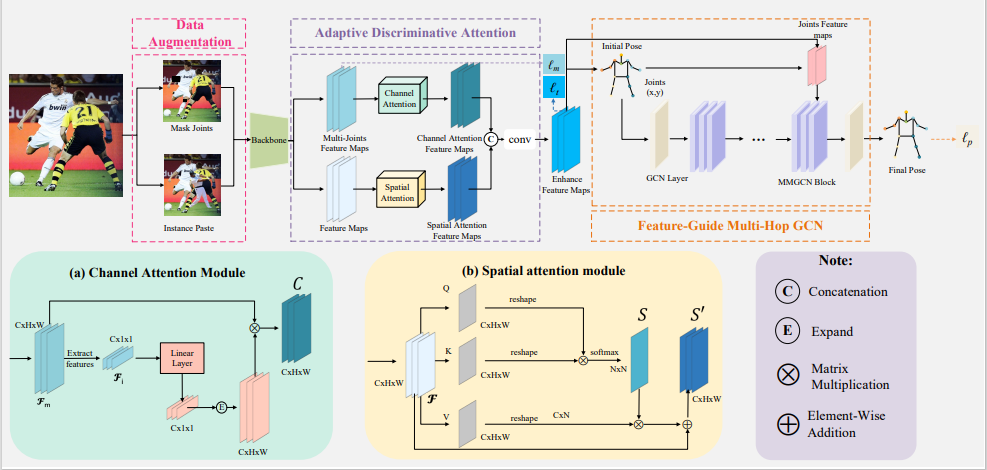

# A comprehensive framework for occluded human pose estimation (ICASSP 2024)
This is an official pytorch implementation of [*A comprehensive framework for occluded human pose estimation*](). 
Occlusion presents a significant challenge in human pose estimation. The challenges posed by occlusion can be attributed to the following factors: 1) Data: The collection and annotation of occluded human pose samples are relatively challenging. 2) Feature: Occlusion can cause feature confusion due to the high similarity between the target person and interfering individuals. 3) Inference: Robust inference becomes challenging due to the loss of complete body structural information. The existing methods designed for occluded human pose estimation usually focus on addressing only one of these factors. In this paper, we propose a comprehensive framework DAG (Data, Attention, Graph) to address the performance degradation caused by occlusion. Specifically, we introduce the mask joints with instance paste data augmentation technique to simulate occlusion scenarios. Additionally, an Adaptive Discriminative Attention Module (ADAM) is proposed to effectively enhance the features of target individuals. Furthermore, we present the Feature-Guided Multi-Hop GCN (FGMP-GCN) to fully explore the prior knowledge of body structure and improve pose estimation results. Through extensive experiments conducted on three benchmark datasets for occluded human pose estimation, we demonstrate that the proposed method outperforms existing methods. </br>



## Quick start
### Installation

1. The environment installation can follow [REDAME.md](https://github.com/leoxiaobin/deep-high-resolution-net.pytorch/blob/master/README.md) 
2. The details about dataset can be referred to [REDAME.md](https://github.com/leoxiaobin/deep-high-resolution-net.pytorch/blob/master/README.md) 
3. Download the hrnet pretrained weights from [GoogleDrive](https://drive.google.com/drive/folders/1hOTihvbyIxsm5ygDpbUuJ7O_tzv4oXjC?usp=sharing) or  [OneDrive](https://1drv.ms/f/s!AhIXJn_J-blW231MH2krnmLq5kkQ)
4. Download the DAG  pretrained weights from [BaiduNetdisk](https://pan.baidu.com/s/1sIWLMGxiW_imh3Ww7IAeCw?pwd=4vyb ) or [GoogleDrive](https://drive.google.com/drive/folders/1wvWwM5vnFhZbB7YWwidfhSFJ h1PLHfum?usp=drive_link) or [OneDrive]([DAG](https://1drv.ms/f/s!AguyI3aFOsEAiR35Czx_ICSWGQ39?e=KKPu42))

### Training and Testing

#### Testing on COCO val2017 dataset 


```
python tools/test_dag.py \
    --cfg experiments/coco/DAG/w32_256x192_adam_lr1e-3.yaml \
    TEST.MODEL_FILE models/pytorch/pose_dag/DAG_w32_256x192.pth \
    TEST.USE_GT_BBOX False
```

#### Training on COCO train2017 dataset

```
python tools/train_dag.py \
    --cfg experiments/coco/DAG/w32_256x192_adam_lr1e-3.yaml
```


### Citation
Will be updated after ICASSP'24 proceedings is released

### Acknowledgement

* HRNet
* STIP
* MM-GCN
